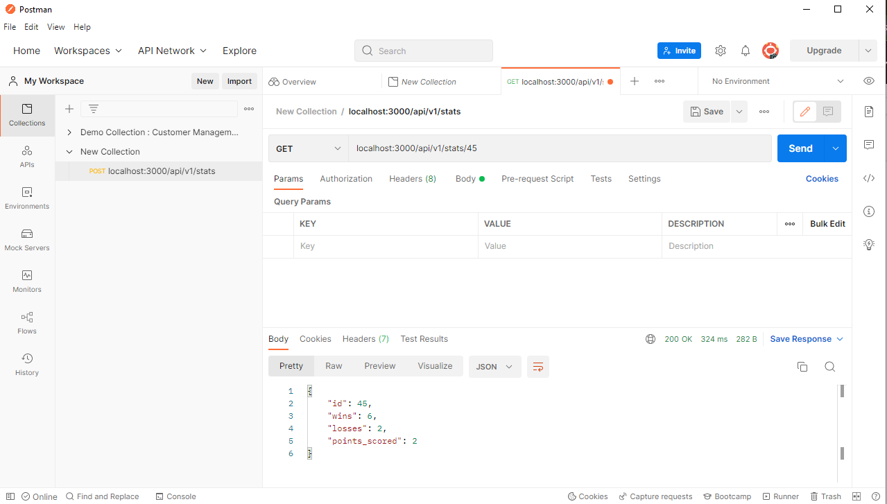
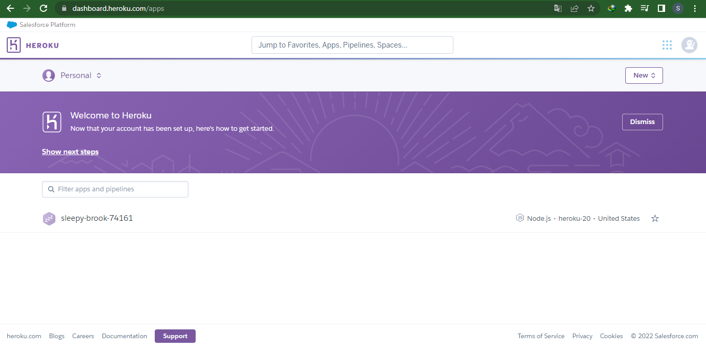

<details>
  <summary>Table of Contents</summary>
  <ol>
    <li>
      <a href="# **RESTful API de gestion des statistiques des joueurs de foot  _avec Node.js et Express_**">Contexte du projet</a>
    </li>
    <li><a href="## Technologies utilisées pour construire l'API">Techonologies utilisés</a></li>
    <li><a href="### Packages installés">Packages installés</a></li>
    <li>
      <a href="## Fonctionnement de L'API">Utilisation de l'API sous Postman</a>
      <ul>
        <li><a href="#route">Terminaison des liens</a></li>
        <li><a href="## Signification des status">Signification des Status</a>
          <ul>
            <li><a href="### Erreur">Status d'erreur</a></li>
            <li><a href="### Réussite">Status de réussite</a></li>
          </ul>
        </li>
      </ul>
    </li>
    <li><a href="## Auteur">Auteur</a></li>
  </ol>
</details>

# **RESTful API de gestion des statistiques des joueurs de foot  _avec Node.js et Express_**

Dans le cadre de la digitalisation du système de gestion des statistiques des joueurs, nous avons conçu une solution répondant aux critères de performance suivant: 

- L'API passe les test GET, POST, PUT et DELETE sur [PostMan](https://www.postman.com/)



- Site deployé sur [Heroku](https://dashboard.heroku.com/)


## Technologies utilisées pour construire l'API:
- NodeJS
- Javascript
- Express - Framework Web rapide, sans opinion et minimaliste pour  Node.js


### Packages installés 
- nvm - Node version Manager 
- npm - Node Package Manager 
- Node.js
- Express installé avec npm (npm install express body-parser morgan).
## Fonctionnement de L'API

#### Route 

```http
  GET /api/v1/stats/:id
```
```http
  POST /api/v1/stats/
```
```http
  PUT /api/v1/stats/:id
```
```http
  DELETE /api/v1/stats/:id
```

| Methode | URL     | Description                |
| :-------- | :------- | :------------------------- |
| `GET` | https://sleepy-brook-74161.herokuapp.com/api/v1/stats/45 | **Créer et enregistrer les stats d'un joueur** |
| `POST` | https://sleepy-brook-74161.herokuapp.com/api/v1/stats | **Obtenir les informarions d'un joueur à partir de son identifiant** |
| `PUT` |https://sleepy-brook-74161.herokuapp.com/api/v1/stats/45 | **Mettre à jour les informations d'un joueur existant** |
| `DELETE` | https://sleepy-brook-74161.herokuapp.com/api/v1/stats/45 | **Supprimer les stats d'un joueur** |


## Signification des status

### Erreur

`404` : *Les statistiques du joueur n'existent pas*

`500` : *Erreur du serveur*

### Réussite
`201` : *Les statistiques du joueur ont été crées* 

`200` : *La requete a été exécuté avec succès*


## Auteur

- [@Sethibrothers](https://www.github.com/sethisbrothers)

